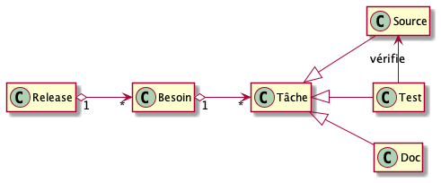
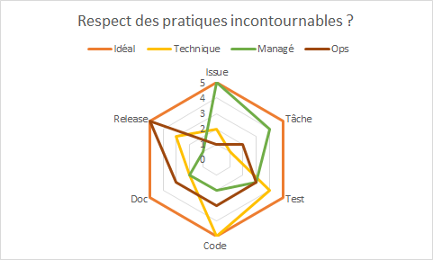

La valeur dans les projets logiciels vue par un développeur
============================================================

Vous êtes un développeur et, comme tout développeur, vous êtes soucieux de la valeur de vos développements.

Pour autant, lorsque vous démarrez un projet logiciel, vous n'avez peut-être pas une vision précise des différents points qu'il faut prendre en compte.
Certes, il faut être soucieux du code ... mais aussi des tests, des issues, des tâches, de la documentation et des releases.

Du coup, connaissez vous des pratiques incontournables du génie logiciel ? Si oui, les appliquez-vous ? Savez-vous mesurer les bénéfices qu'elles apportent ? Savez-vous identifier les pertes que vous risquez à ne pas les suivre ?

Et si vous vous testiez grâce à [notre quizz](https://docs.google.com/forms/d/e/1FAIpQLSdvq-DgoZ8mJMLnCYOcagYdgb6h-LH-XZ3yidtTQfFGSEF1DQ/viewform) ?

Nous proposons ici une liste minimale des points à contrôler s'appliquant à n'importe quel projet logiciel.
Nous considérons [6 artefacts](#pourquoi-6-artefacts-) sur lesquels la production doit être absolument contrôlée.
L'approche que nous proposons est très minimaliste et très orientée "développeur" (donc technique).

**Elle permet à tout développeur de mieux comprendre les enjeux de la production logicielle !**

Notre approche n'a pas pour objectif de répondre à toutes les problématiques du chef de projet. Il y a des méthodes bien adaptées à cela.

L'objectif est de pouvoir mesurer la qualité technique d'un projet logiciel en fonction de ces 6 artefacts. Vous pourrez ainsi savoir si votre projet est idéal (ou presque), s'il est bien organisé (les issues et les tâches ont une très bonne qualité, par contre le code, les tests, la doc et les releases moins), ou s'il est plutôt technique (le code et les tests ont une bonne qualité mais pas les issues, les tâches, la doc et les releases), etc.

Notre approche se veut ouverte. Elle est donc matérialisée par un projet GitHub afin de favoriser tout un chacun à y participer (n'hésitez pas à envoyer vos pull-request). La [méthode employée](./METHODE.md) pour réaliser notre objectif est elle aussi ouverte et clairement détaillée permettant de bien mesurer l'apport de chaque pratique.

Les Pratiques Incontournables
===============================

* [issues : l'expression des besoins que le logiciel doit couvrir](./issue/)
* [tâches : les travaux à effectuer pour réaliser les issues](./tache/)
* [tests : la vérification du logiciel](./test/)
* [code source : les instructions que la machine va exécuter](./code/)
* [documentation : les explications du logiciel](./doc/)
* [release : ce qui va être déployé, exécuté et donc utilisé](./release/)

Pourquoi 6 artefacts ?
======================

Nous considérons que toute production de logiciel nécessite l'élaboration d'au moins six artefacts : Issue, Tâche, Test, Code source, Documentation, Release.

Chacun des ces artefacts est facilement identifiable par des fichiers (même si la documentation peut être incluse dans un fichier de code source, il est facile de la distinguer).

Chaque artefact a des pratiques qui lui sont propres. Les pratiques incontournables que nous identifions ciblent un type d'artefact et améliorent un de ses aspects.

Chaque artefact est en relation avec les autres artefacts. Une pratique ciblant un artefact a donc un effet sur les autres artefacts en relation.

Chaque artefact peut être modifié permettant ainsi de faire évoluer le logiciel. Une pratique permet ainsi de préciser la façon dont les modifications doivent être réalisées pour améliorer l'artefact.

Quelle méthode est employée pour identifier une pratique incontournable ?
=========================================================================

Notre liste des pratiques incontournables est complètement ouverte.

Le [guide de rédaction](./METHODE.md) des pratiques décrit la méthode que nous avons utilisée. Cette méthode est elle aussi ouverte.

QUIZZ : Suivez-vous les pratiques incontournables ?
===================================================

Nous vous proposons un Quizz qui vous permettra de mesurer l'état de vos pratiques. Vous pourrez ainsi savoir quels sont artefacts sur lesquels vous pouvez améliorer vos pratiques.

Répondez à maintenant [notre quizz](https://docs.google.com/forms/d/e/1FAIpQLSdvq-DgoZ8mJMLnCYOcagYdgb6h-LH-XZ3yidtTQfFGSEF1DQ/viewform) !

Ce qu'est notre approche et ce qu'elle n'est pas ?
=========================================================================

Notre approche liste des pratiques incontournables s'appliquant à tout projet logiciel. Chaque pratique listée est clairement détaillée et sa valeur ajoutée est rigoureusement qualifiée permettant ainsi de mesurer son effet.

Notre approche n'est pas une nouvelle méthode expliquant les différentes étapes à réaliser pour développer un logiciel. Pour autant, certaines pratiques proposées par certaines méthodes améliorant la qualité sont référencées.

Notre approche n'est pas un nouveau standard de production logiciel. Notre objectif n'est absolument pas d'en définir un nouveau. L'objectif étant de référencer des pratiques incontournables et de préciser quels aspects elles améliorent.
